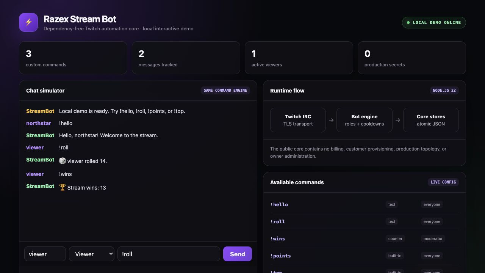

# Razex Stream Bot

A dependency-free Node.js core for Twitch chat automation. It provides a live IRC bot,
an interactive local dashboard, custom commands, role gates, cooldowns, activity and
loyalty tracking, timers, alerts, and a persistent music queue.

This repository is the reusable open-core extracted from a production streaming
automation platform. Billing, customer provisioning, owner administration, production
topology, and deployment credentials are intentionally not included.



## Why this project exists

Streamers often combine several bots and dashboards for commands, engagement, timers,
and overlays. Razex Stream Bot keeps the core workflow in one small, auditable service:

```text
Twitch chat
    │ TLS / IRC tags
    ▼
TwitchIrcClient ──▶ StreamBotEngine ──▶ role + allowlist + cooldown checks
                           │
                           ├──▶ custom command runner
                           ├──▶ activity and loyalty stores
                           ├──▶ timers and alert bus
                           └──▶ sanitized chat reply
```

## Highlights

- No runtime npm dependencies; built on Node.js 22 standard APIs.
- Twitch IRC parsing and reconnect support.
- EventSub client for stream, raid, chat, and reward events.
- Typed custom commands: text, random, counter, music, and dynamic values.
- Twitch roles, per-user allowlists, global and per-user cooldowns.
- Template variables such as `{user}`, `{target}`, `{random:1-100}`, and `{count}`.
- SSRF-resistant `{urlfetch:...}` commands: private addresses and unsafe redirects are blocked.
- Atomic JSON persistence with private file permissions and corrupt-file quarantine.
- Activity rankings, loyalty points, periodic timers, an alert bus, and a music queue.
- 112 automated tests, including network-boundary and IRC-injection cases.

## Run the local demo

The demo uses the real command engine and local JSON stores. It does not require a
Twitch account or any credentials.

```bash
git clone https://github.com/RAZEX0LOL/razex-stream-bot.git
cd razex-stream-bot
node src/demo-server.js
```

Open [http://127.0.0.1:3000](http://127.0.0.1:3000) and try:

- `!hello`
- `!roll`
- `!points`
- `!top`
- `!wins` while the role selector is set to Moderator

With Bun, the equivalent command is `bun run demo`.

## Run against Twitch chat

1. Create a Twitch User Access Token with `user:read:chat` and `user:write:chat`.
2. Create a local environment file:

```bash
cp .env.example .env
chmod 600 .env
```

3. Fill in the three required values:

```dotenv
TWITCH_ACCESS_TOKEN=your_user_access_token
TWITCH_BOT_LOGIN=your_bot_login
TWITCH_CHANNEL=channel_to_join
```

4. Start the bot:

```bash
node src/live-bot.js
```

On first start, the bot creates `.data/commands.json` with safe example commands.
Runtime state is ignored by Git and written atomically.

## Tests and safety checks

```bash
node --test
node scripts/check-public-safety.mjs
```

Or run both:

```bash
bun run check
```

The public-safety check rejects credential patterns, production-domain markers,
executables, oversized files, and common private configuration filenames.

## Project structure

```text
src/
  stream-bot-engine.js   transport-independent command pipeline
  live-bot.js            single-channel Twitch IRC runtime
  demo-server.js         credential-free interactive dashboard
  command-runner.js      templates, roles, actions, safe URL fetching
  custom-commands-store.js
  activity-store.js
  loyalty-store.js
  music-queue.js
  eventsub.js
  irc-client.js
  features/              small plugin examples
test/                    Node test runner suite
examples/commands.json   sanitized command configuration
```

## Security model

- Secrets belong in `.env` or a secret manager, never in source or JSON examples.
- Outgoing IRC messages have newlines and null bytes stripped to prevent command injection.
- Remote URL commands resolve DNS and reject loopback, private, link-local, metadata,
  documentation, and unsafe redirect targets.
- Persistent stores use atomic replacement; token-like state receives private permissions.
- The demo binds to loopback by default.

See [SECURITY.md](SECURITY.md) for reporting vulnerabilities.

## License

MIT © Rasul Khattaev. See [LICENSE](LICENSE).
